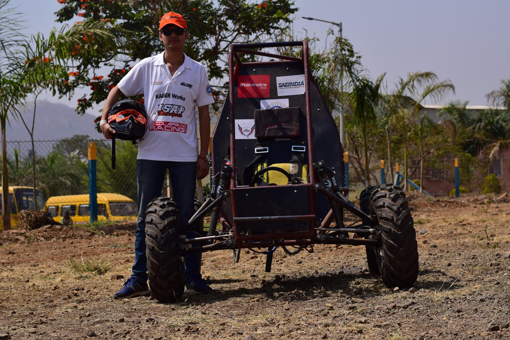
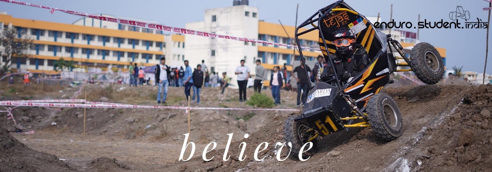
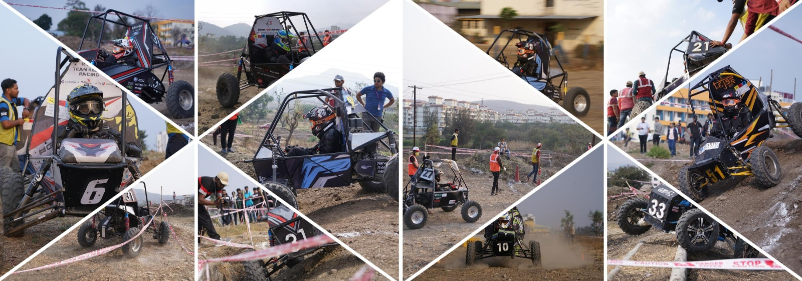
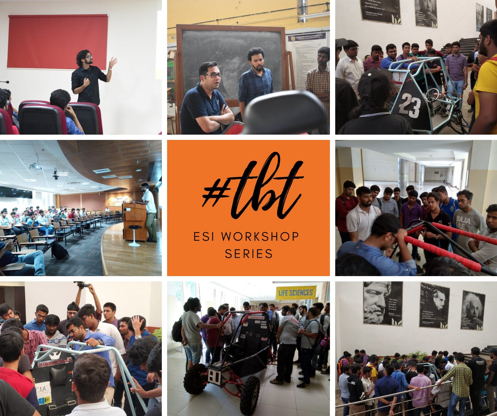
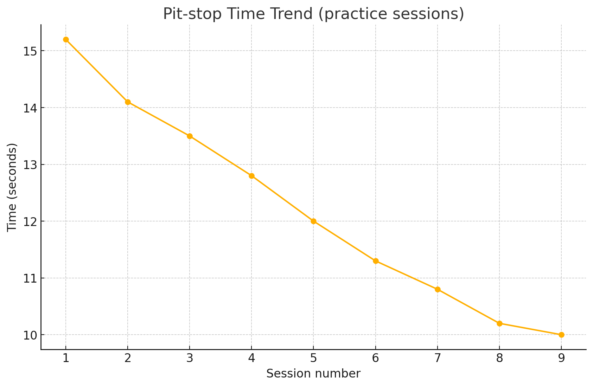

# Enduro Student India – Cross‑Subsystem Team Lead (Ops/QA/Pit)

**Timeline (hands‑on):** 20 Nov 2018 → 19 Feb 2019  
**Role:** Team Lead for Powertrain, Drivetrain, Brakes, Vehicle Dynamics, Testing, Quality Assurance, Pit‑Stop, and Detailing (led a 12‑member sub‑team in a 30‑member team)  
**Location:** India (Event in Pune, Maharashtra)  
**Competition:** Enduro Student India (14–19 Feb 2019)  
**Outcome:** Learning‑focused entry (no awards claimed)

> This is an academic/portfolio repository. It documents learning, roles and process. No proprietary IP is shared.

## Provenance & integrity
- Original student project executed in **2018–2019**; this repository was **reconstructed in Sept‑2025** from photos, the project report, and memory.  
- CAD/CAE files are **not** shared due to team policy and IP restrictions.  
- Any later edits (typos, captions) are tracked in the **changelog**.  
- Time beyond 2019 is **not** continuous build work; see **Time accounting** for how effort is represented.

## Vehicle – key specification
| Attribute | Value |
|---|---|
| Model | Briggs & Stratton Model 19 |
| Displacement | 305 cc |
| Engine | Single‑cylinder, 4‑stroke |
| Max power | 9 HP @ 3600 rpm |
| Max torque | ~17.5 Nm @ 3600 rpm |
| Fuel system | Carburettor |
| Fuel capacity | ~5 L |
| Starter | Rewind (handle at ~10:30 position) |

## Responsibilities (cross‑functional leadership)
- Coordinated **redesign and refabrication** of damaged roll‑cage sections; added reinforcements and managed fit‑up/welding with workshop teams.  
- Led **integration & QA gates** (steering, braking, drivetrain, powertrain alignment, CVT belt line, chain tension).  
- Built a **campus test track**; designed **durability tests** (rollover sim, 4‑ft drop, drag runs) and captured actions.  
- Ran **pit‑stop training** (tyre change, refuelling, brake/suspension checks) with a target of **≤10 s** per task; defined roles and rota.  
- Managed **transport logistics** (disassembly for train, re‑assembly in Pune, spares/tools); maintained run‑sheet and risk log.  
- Supported **sponsorship & approvals**: branding on T‑shirts/vehicle, university permissions and scheduling.

## Key notes from the project report
- Roll‑cage and steering rack damage from a previous event required **cut‑and‑replace + reinforcement**; redesigned within existing chassis constraints and fabricated successfully.  
- Only **five days** of track preparedness following the rebuild drove a focus on **driver selection/training** and **accelerated QA**.  
- Pune operations: **re‑assembly, scrutineering, dynamic events**; nightly end‑of‑day checks and pit readiness.  
(See `/docs/Project_2_Enduro_Student_India_Report.docx` for the narrative.)

## Evidence
- Context images (workshops, event promos and crowds): see [`/media/context`](./media/context). These illustrate the scale and nature of ESI 2019 and are used for educational/portfolio context only.

- Photos: [`/media/photos`](./media/photos)  
- Videos (host externally; links in `/docs/links.md`).  
- Project report: [`/docs/Project_2_Enduro_Student_India_Report.docx`](./docs/Project_2_Enduro_Student_India_Report.docx)

## Time accounting (how the dates are presented)
- **Phase A — Rebuild, testing & event (20 Nov 2018 → 19 Feb 2019):** redesign/refabrication, integration, QA, driver training, pit‑ops, logistics, Pune event **≈ 240–300 hours**.  
  **Progress log:** [week‑by‑week record](./docs/progress-log_2018-11-20_to_2019-02-19.md) · [weekly hours CSV](./docs/weekly_hours_enduro.csv) · [category split CSV](./docs/progress_hours_breakdown_enduro.csv).  
- **Phase B — Post‑event documentation (20 Feb → 08 Mar 2019):** *intermittent* tidy‑ups, notes, and handover material (**0–3 hrs/week typical**).  
- **Phase C — Repo reconstruction (Sept‑2025):** structure + README + captions **~6–8 hours**.

## Skills demonstrated (relevant to Ops / Supply Chain / Admin)
- Cross‑functional coordination, QA discipline, checklists/rotas, inventory & spares planning, logistics, concise documentation.

## File map
```
/docs             # progress log, CSVs, report, run-sheet, risk log, changelog, links
/media/photos     # event and build photos
/media/videos     # (keep empty on GitHub; host large files in Drive/OneDrive)
/media/evidence   # credentials or IDs (if any)
```

## Changelog
- 2025-09-09: Repository reconstructed; images and README added; progress log created; provenance documented.

## Contact
**Kshitij Pandey** · <add_email_here> · [LinkedIn](add_link_here)

---

## Evidence gallery (selected)
Below are a few representative photos from preparation and event activities. See all images in [`/media/photos`](./media/photos) and captions in [`/docs/evidence-captions.md`](./docs/evidence-captions.md).






---

## Operational KPIs (one‑page summary)
- See detailed notes: [`docs/kpis.md`](./docs/kpis.md)
- **Pit‑stop time trend (practice):** consistently reduced from ~15s to the **≤10s target**.    
- **Weekly effort (Kshitij only):**    

---

## FAQ (Integrity, dates, and missing files)
**Why are there no CAD files here?** The team’s designs are not shared publicly for IP reasons; this repo is a learning/portfolio record with photos, logs and summaries.  
**Do the dates imply 3 months of continuous building?** No—the **Time accounting** section explains hands‑on work vs. intermittent documentation.  
**How do I verify the story?** Cross‑check the progress log, photos, report, and the week‑by‑week hours; large videos are available via links in `docs/links.md`.
